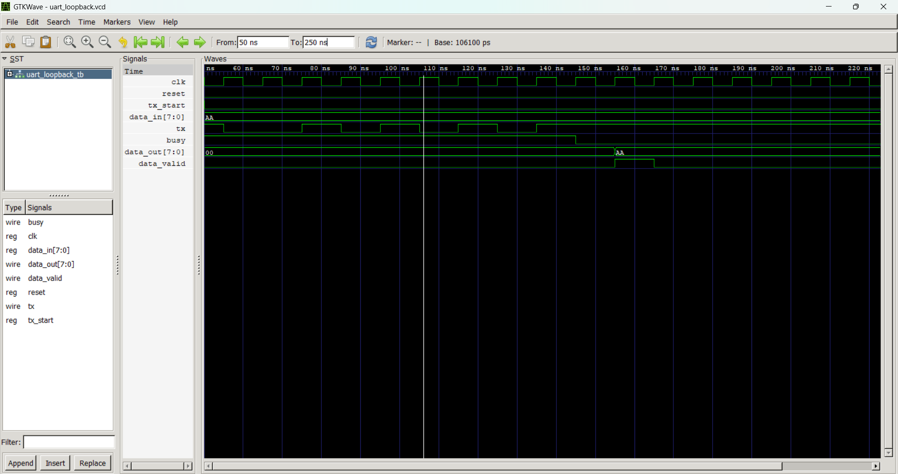

# UART Communication System using Verilog HDL

## Overview

This project implements a UART (Universal Asynchronous Receiver Transmitter) communication system using Verilog HDL.

## Features

- UART Transmitter (TX)
- UART Receiver (RX)
- UART Loopback Verification
- FSM-Based Design
- Functional Simulation

## Tools Used

- Verilog HDL
- Icarus Verilog
- GTKWave

## Verification Results

Input Data  : 0xAA (10101010)

Output Data : 0xAA (10101010)

Loopback communication verified successfully.

## Simulation Waveform

## Author

Nitin Lagdive
